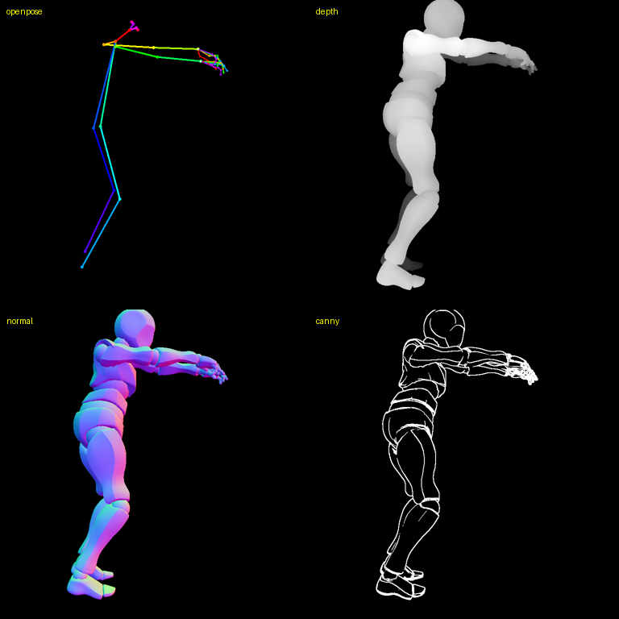

# ComfyUI-FBX-ControlNet-Converter

Turn a rigged 3D animation (**FBX / GLB**) into **ControlNet conditioning passes** — OpenPose,
depth, normal, alpha (silhouette), and canny — directly inside ComfyUI. A bundled native
**C# / OpenGL** CLI does the rig evaluation, skinning, and rendering; the node loads the
resulting frame sequence as an `IMAGE` batch you can wire straight into ControlNet /
AnimateDiff.

No Python 3D dependencies, no preprocessor guesswork — the passes come from the actual
skeleton and mesh, so they are geometrically exact and temporally stable.



## Passes

| `render_pass` | Output | Needs mesh? |
|---|---|---|
| `openpose` | Standard OpenPose stick figure (BODY‑18 + 21‑pt hands) | no |
| `depth` | Grayscale depth (near = bright) | yes |
| `normal` | View‑space normal map (RGB) | yes |
| `alpha` | White silhouette / matte mask | yes |
| `canny` | Edge map (Sobel on normals) | yes |

OpenPose is reconstructed from bone transforms (no embedded pose mesh required). The mesh
passes render the skinned character with an offscreen OpenGL framebuffer.

## Install

This repo bundles the prebuilt Windows binary (~80 MB) via **Git LFS**, so install Git LFS
first, then clone into ComfyUI's `custom_nodes`:

```bash
git lfs install
cd ComfyUI/custom_nodes
git clone https://github.com/Bo-sung/ComfyUI-FBX-ControlNet-Converter
```

Restart ComfyUI. The node **FBX → ControlNet Converter** appears under the category
**FBX ControlNet**. (Windows x64 only.)

> If you cloned without LFS, `bin/fbxcontrolnet.exe` will be a tiny pointer file — run
> `git lfs pull` inside the repo, or build from source (below).

## The Mixamo workflow (rig + animation clip)

Mixamo lets you export an animation **with** or **without** skin. Mesh passes
(depth/normal/alpha/canny) need geometry, so the common setup is:

- `fbx_path` → a **skinned** character (e.g. `Y Bot.fbx`, downloaded *with skin*)
- `anim_path` → the **animation‑only** clip (e.g. `Zombie Walk.fbx`)

The clip's motion is retargeted onto the rig by matching bone names. OpenPose works from
either a skinned or animation‑only file (it only needs the skeleton).

## Key node inputs

- `render_pass` — `openpose | depth | normal | alpha | canny`
- `fbx_path`, `anim_path` (optional)
- `width`, `height`, `fps`, `frames` (0 = whole clip at `fps`)
- Camera: `cam` (`front/back/left/right/custom`), `cam_yaw`, `cam_pitch`, `cam_zoom`,
  `cam_fov`, `cam_ortho`
- Space: `center` (`xz` in‑place / `xyz` / `off`), `up_axis` (`y`/`z`), `scale`, `mirror`
- Style: `line_width`, `dot_radius`, `draw_hands`, `draw_face`, `bg` (`r,g,b` 0..255)
- `exe_path` — defaults to the bundled `bin/fbxcontrolnet.exe` (or set the `FBXCN_EXE` env var)

`fps`/`frames` are independent of the source's authored fps — frames are interpolated, so you
can resample freely (e.g. a 24 fps clip → `fps 6`).

## CLI (optional, standalone)

```powershell
bin\fbxcontrolnet.exe --input "Y Bot.fbx" --anim "Zombie Walk.fbx" `
  --passes openpose,depth,normal,canny --out .\frames --cam left
```
`fbxcontrolnet.exe --help` lists every option.

## Build from source

Requires the **.NET 8 SDK**:

```powershell
./build.ps1        # publishes the self-contained win-x64 build into ./bin
```

Source layout: `cli/` (C# — `Core` library + `Cli` executable), `cli/data/bone_map.json`
(bone‑name normalization table). The architecture keeps every pass behind an `IRenderPass`
plugin and the CLI behind a stable contract, so the native core could be re‑implemented in
C++ without touching the node.

## License

Original source: **MIT** (see `LICENSE`). The bundled binary includes third‑party libraries
under their own terms — see `THIRD-PARTY-NOTICES.txt`. Note **SixLabors.ImageSharp** uses the
Six Labors Split License (free for open‑source and orgs under USD $1M revenue; commercial
license required otherwise).

The bone‑name mapping table and all source here are original work. The concept was inspired
by ComfyUI‑Yedp‑Action‑Director; no third‑party code is reused.
